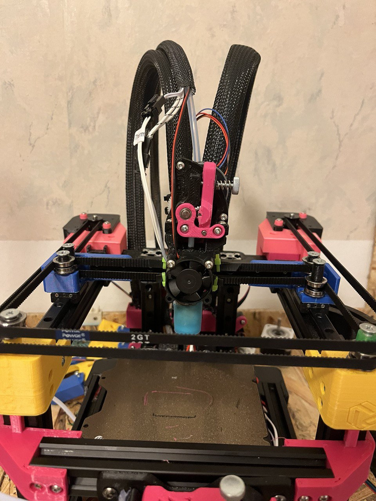
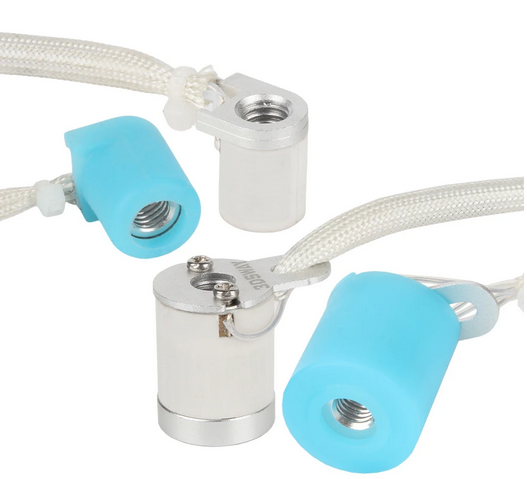
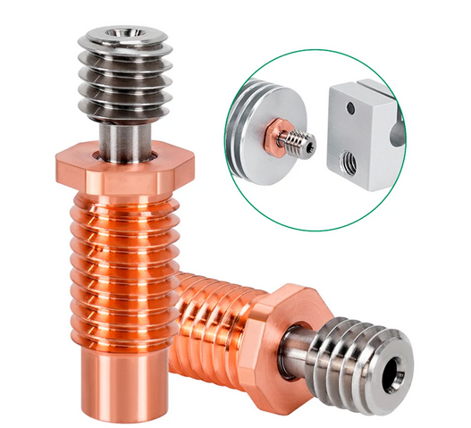
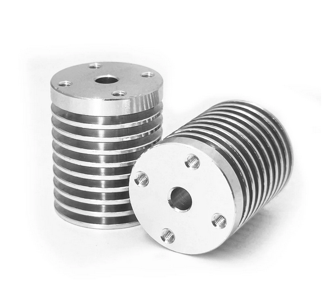
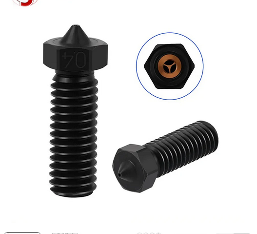

# There are a bunch of hotends on the market.

And I hate all of them.

You either get something that doesn't cause you instant headache, or you get something that can actually print faster than a 2017 ender.

Here is what I've been using on a quick little custom printer. I'll leave links for the parts but they get pulled often so you might need to do some digging.

# Volcodragon

### A volcano that's also a dragon kinda?

1) heater - $15

The thing on the right, a volcano length ceramic heater with added metal for thermal mass, is going to be the star of the show. It heats up in seconds, has enough mass to retain that heat, and doesn't cool itself down if you extrude plastic in big bursts. If you can't use the links, search for either 3Dsway or Lerdge, they seem to be selling this part.

[click](https://www.aliexpress.us/item/3256805511955007.html)

[clack](https://www.aliexpress.us/item/3256805399853202)

2) Heatbreak - $5

Standard V6 style bimetal heatbreak, prevents creep and has a nice hex thing if you overtighten it, I've lost too many heatsinks to un-hexed ones.

[clickity](https://www.aliexpress.us/item/3256802596412648), but it's a very common part, you can probably find it anyway

3) Heatsink - $10

Dragon size sink, without the awful dragon style radiator. There is a generic version and something called _V6DM_ by trianglelab. The latter is 1mm thicker, so pay attention to that, but it should fit in most toolheads, the screw pattern is the same.

[chinese clone](https://www.aliexpress.us/item/3256804661463785)

[chinese clone with a name](https://www.aliexpress.us/item/3256805009241591)

4) nozzle - $3

I mean you can use any volcano nozzle i guess but I had really nice consistent flow with these ones.

[clock](https://www.aliexpress.us/item/3256806034080733)

<iframe width="560" height="315" src="https://www.youtube.com/embed/bzcqtBv4nzc?si=nj70hEI6n2F0W37E" title="YouTube video player" frameborder="0" allow="accelerometer; autoplay; clipboard-write; encrypted-media; gyroscope; picture-in-picture; web-share" referrerpolicy="strict-origin-when-cross-origin" allowfullscreen></iframe>

<iframe width="388" height="690" src="https://www.youtube.com/embed/48qS4w9k2-U" title="" frameborder="0" allow="accelerometer; autoplay; clipboard-write; encrypted-media; gyroscope; picture-in-picture; web-share" referrerpolicy="strict-origin-when-cross-origin" allowfullscreen></iframe>
